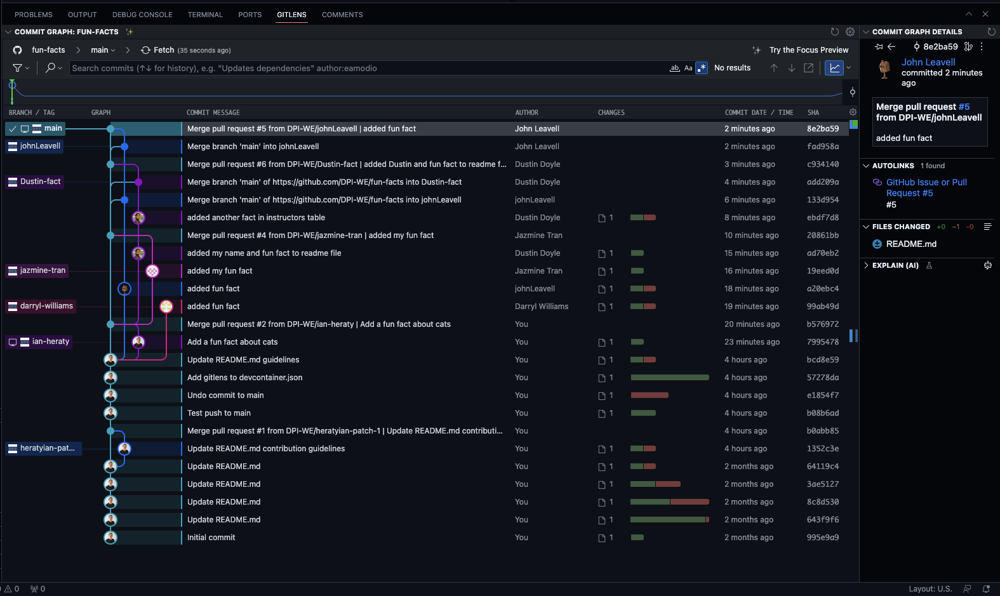
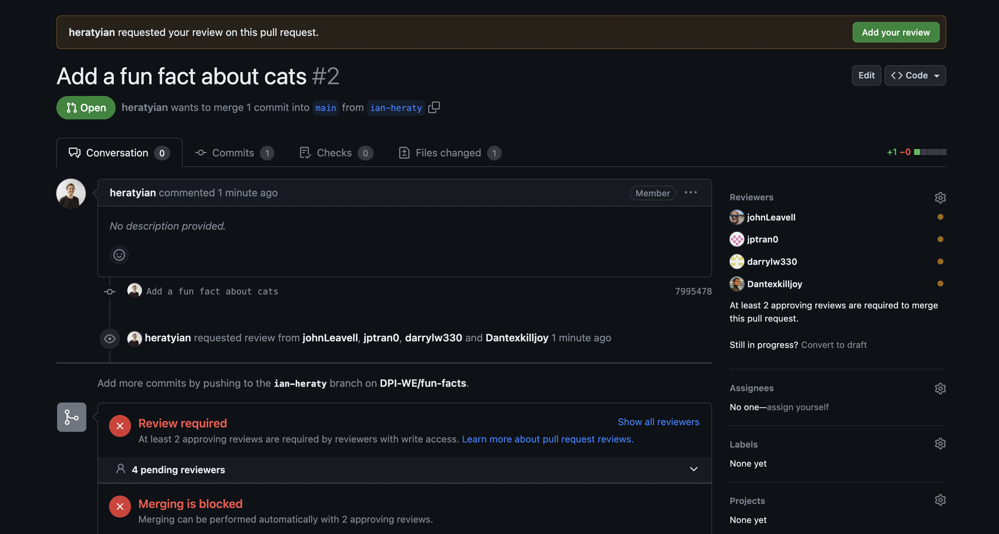
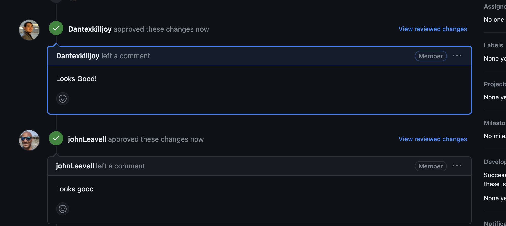
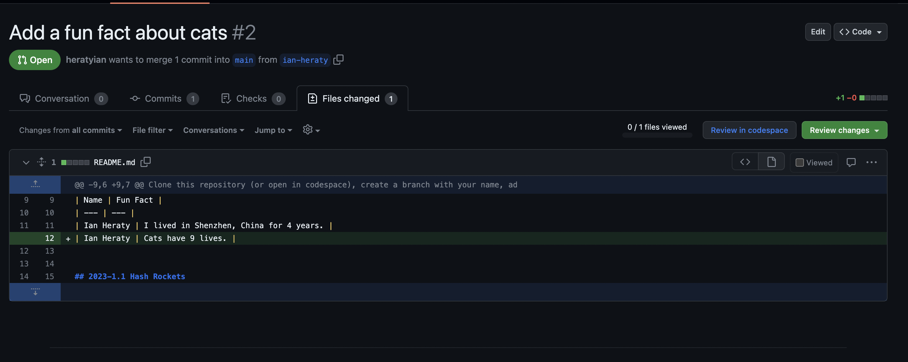
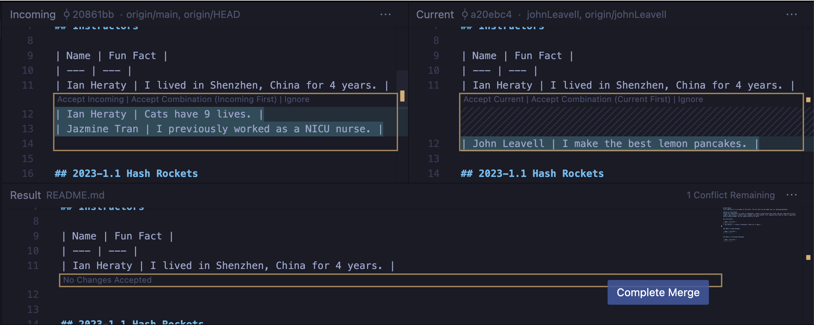
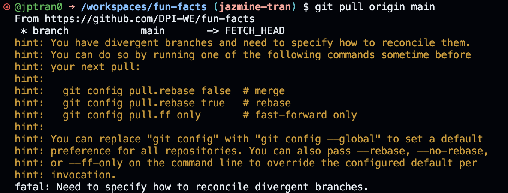

# <!--fit--> Code Review

---

# 🌟 Why?
- One of the most important components of staying happy for developers is feeling like we’re always continuing to learn.
- One of the best ways to promote learning on a team is a strong Code Review Culture.

---
# 🌟 Why?

- It feels great to get alternative ideas on how to attack a problem right when you are setting out.
- Often, someone else on the team can alert you to a different approach that you hadn’t considered or heard about.

---
# 🌟 Why?

- You would be surprised at how often a junior developer can teach a senior developer a new trick.
- Code Review is an incredibly good way to train junior developers.
- Code Reviews demolish knowledge silos, reducing your risk.
- Oh, and they helps catch bugs sometimes, too.

---
# 🛤️ Git Flow

- Master/Main Branch 🏛️
  - The 'sacred' branch.
  - Always production-ready.
- Feature Branches 🌿
  - Branches created to develop new features without disturbing the main branch.

---



---

# 🔀 Git Flow Lifecycle

- Create a feature branch 🌿
```bash
# usually want to create branch from main
git checkout main

# fetch latest changes
git pull

# create new branch (follow suggested naming guidelines)
git checkout -b feature/my-new-feature
```

---
# 🔀 Git Flow Lifecycle

- Implement and commit changes 🧑‍💻
```bash
git add .
git commit -m "Implement my new feature"
```

---
# 🔀 Git Flow Lifecycle
- Push branch to remote 'origin' ☁️
```bash
git push
```
---
# 🔀 Git Flow Lifecycle
- Create a Pull Request (PR) of feature branch into main branch.
- Team reviews pull request 👩‍💻👨‍💻
  - Comment 💬
  - Request changes 🔂
  - Implement, commit, and push changes 🧑‍💻
- Teammates approve (or reject) 👍👎
- Merge into main 🔀

---
# 🤔 Why PRs?



---
#  🤔 Why PRs?
- Allows team members to review code changes before they're merged.



---
#  🤔 Why PRs?
- See a clean diff



---

# 🔥 Merge Conflicts

- Merge conflicts happen when git cannot automatically merge changes. 🤷
- Merge conflicts are caused by overlapping changes. ⛏️🚫
- Identify the conflicted areas and decide which code stays, which code goes. ❗
- Commit the resolved changes.

---
# 🔥 Merge Conflicts



---

# 👩‍🔧 Best Practices

- Regularly pull changes from main branches.

```bash
git pull origin main
```

- Keep feature branches focused and short-lived.

- Clear commit messages.

---

# 👩‍🔧 Best Practices

- Senior and Lead developers are usually very busy
<!-- don't be annoying 😅 -->
- Make sure to reach out if you are waiting on a review

---
# 🤪 Fun Facts
https://github.com/DPI-WE/fun-facts

- Fun Facts is an index of fun facts.
- Follow the contribution guidelines to add your fun fact.


---

# 🛤️ Git Commands & Flow

---

## Check your current branch. Understand where you are.

```bash
git branch
```

---

## Switch to the 'main' branch before creating a new feature branch.

```bash
git checkout main
```

---

## Pull the latest changes from the remote repository (always do this before creating a new branch to ensure you're up-to-date).

```bash
git pull origin main
```

---

## Create a new feature branch:


```bash
git checkout -b feature/cuisine-filter
```

---
## Make changes & commit:

```bash
git add .
git commit -m "Implement cuisine filter functionality"
```
---
## Push your feature branch to the remote repository.

```bash
git push origin feature/cuisine-filter
```
---
## Switch between branches (eg move back to main).

```bash
git checkout main
```
---

## Update your local branch with the latest changes post-merge (always good to stay updated).

```bash
git pull origin main
```

---
# Make sure to set configuration to resolve conflicts using merge

```bash
git config pull.rebase false
```




---

# References

- [RailsConf 2015 - Implementing a Strong Code-Review Culture](https://www.youtube.com/watch?v=PJjmw9TRB7s)